# Glass Launcher for Nakamichi Android head units

An Android home-screen launcher for Nakamichi Android car players, built from the "NAM5240T
Glass Launcher" design handoff (`design-source/`).

**Download:** [`dist/GlassLauncher.apk`](dist/GlassLauncher.apk) (about 3 MB, version 1.1.1).

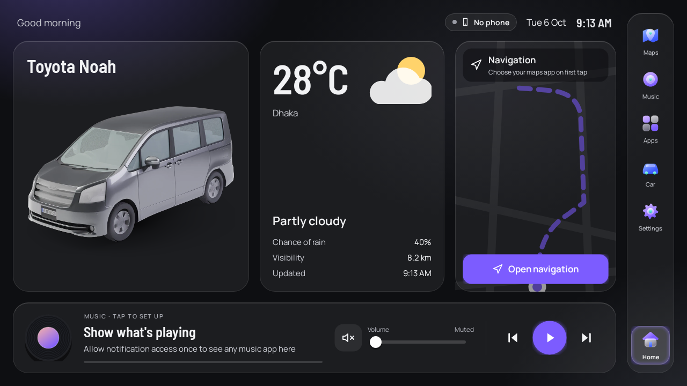

| Car showcase | Minimal | Drive focus |
|---|---|---|
| 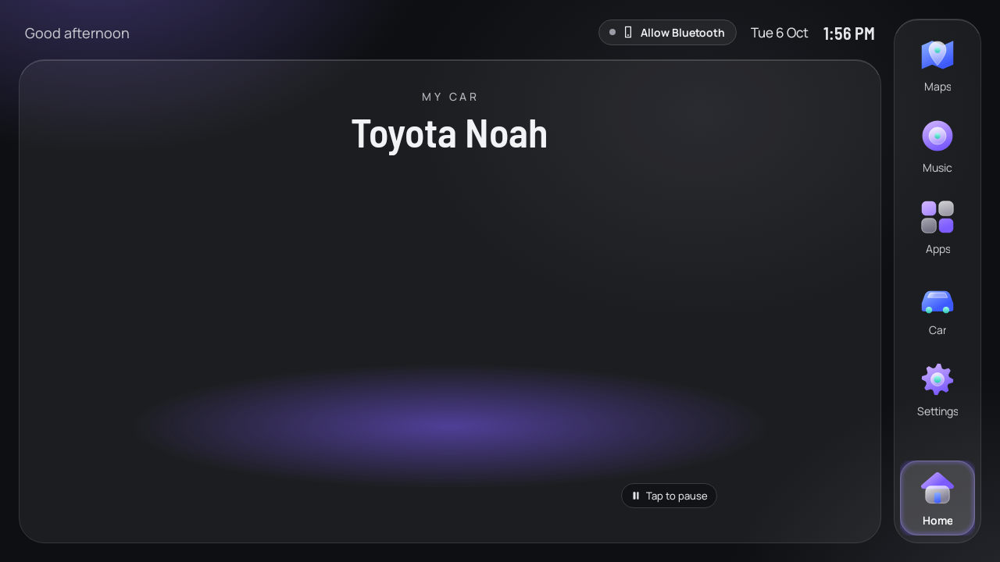 | 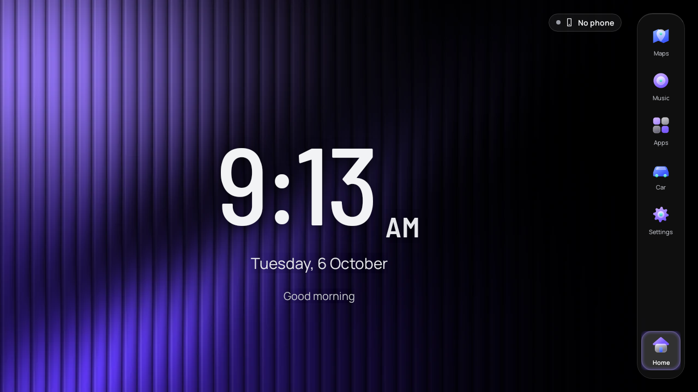 | 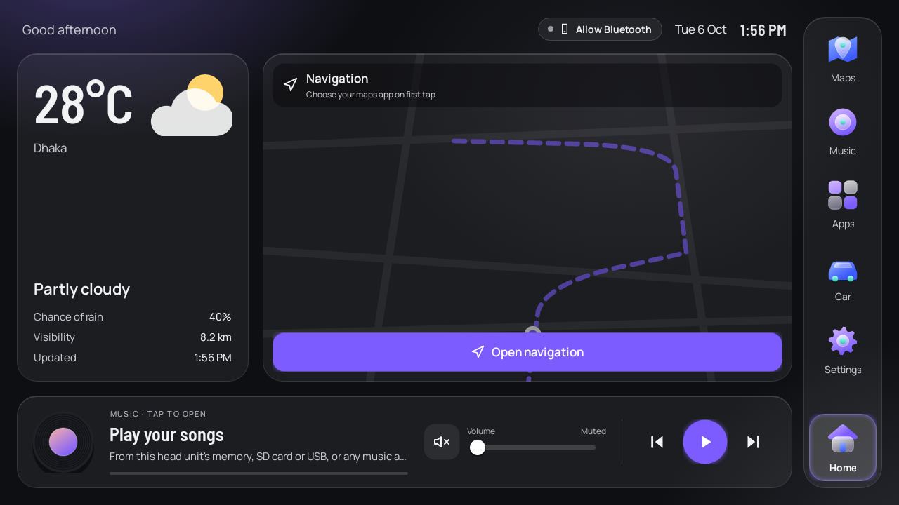 |

| Music | Apps | Settings | Car settings |
|---|---|---|---|
| 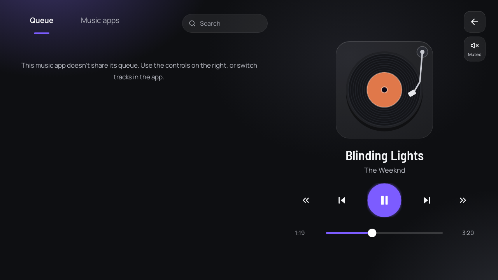 | 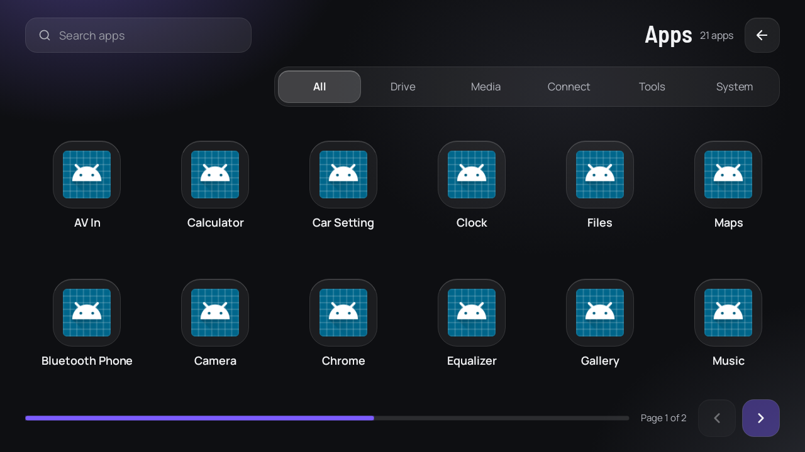 | 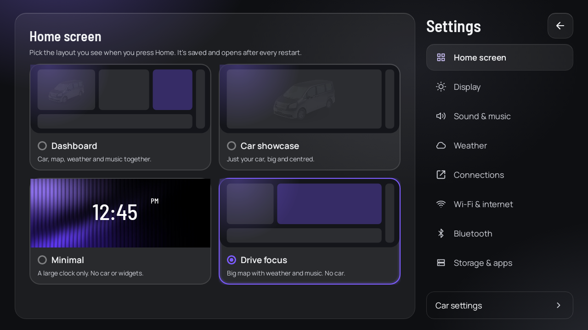 | 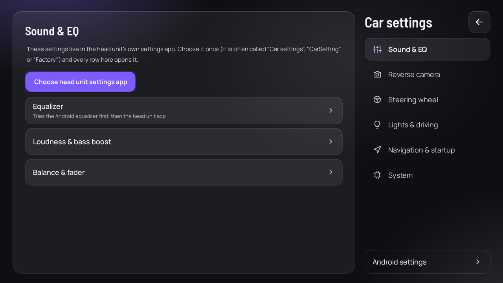 |

## Which head units it supports

It runs on **Android 5.0 (API 21) through Android 15 (API 35)**, at any landscape screen size.

Public spec pages list these Nakamichi Android players and system versions. Nakamichi's own
site couldn't be opened from the build environment, so this list comes from search results and
retailer pages. It may be incomplete or out of date, so check your unit.

| Model | System (as marketed) | Screen |
|---|---|---|
| NAM5010 | "NK 9.0" | 9" / 10.1", 1280×720 |
| NAM5730 | Android 9.0 | 9" / 10.1", 1280×720 |
| NAM5210 | "NK 11.0" (a 7" Android 9 version is also listed) | 10.1" 1280×720 / 7" |
| NAM5230 | "NK 11.0" | 9" / 10.1", 1024×600 or 1280×720 |
| NAM5630 | Android 11 | 9" / 10", 1280×720 |
| NAM5240 / NAM5240T | "NK 13.0" | 9" / 10.1", 1280×720 |

"NK" numbers are Nakamichi's names and don't always equal the real Android version, which is
why the app supports everything from 5.0 up. The setup script prints the real version
(`API` level) of your unit. The NA3600, NA3605 and NAM1610 are CarPlay / mirror-link receivers,
not Android head units, so they can't install apps.

How compatibility is enforced and checked:

- **Old-API guard.** Every call to an Android API newer than 5.0 lives in
  `src/.../NewApi.java`, behind a version check. `build.sh` compiles all other code against the
  real Android 5.0 framework, so a newer call anywhere else stops the build instead of crashing
  an old unit.
- **Two signatures.** The APK carries a v1 signature (Android 5–6) and a v2 signature
  (Android 7+). Both are verified on every build. Uncompressed files are 4-byte aligned, as
  Android 11+ requires.
- **Tested on every version.** `tests/` runs the real app on all 15 versions, Android 5.0 to
  15 (Robolectric). It opens every screen and settings section, switches themes and font sizes,
  sends steering-wheel keys and setup-script commands, loads corrupted settings and checks safe
  mode. All 45 runs pass.
- **Real emulators.** `.github/workflows/glass-launcher-emulator.yml` runs the APK on Android
  emulators (API 21, 26, 30 and 34) on GitHub. It runs the setup script, opens every screen,
  stress-taps with Android's monkey tool and fails on any crash. Screenshots are saved as run
  artifacts.

## Fits any screen

The design is drawn in 1280×720 units and scaled to the usable area of the screen. It updates
whenever the area changes (navigation bar shown or hidden, density change, split screen). On
small 7" screens the text is enlarged up to 30% so it stays readable. These sizes were rendered:

| 800×480 | 1024×600 | 1920×720 |
|---|---|---|
| 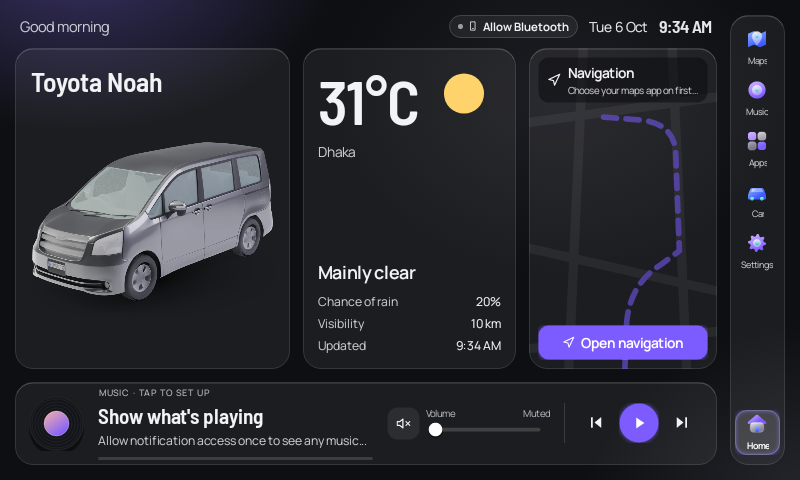 | 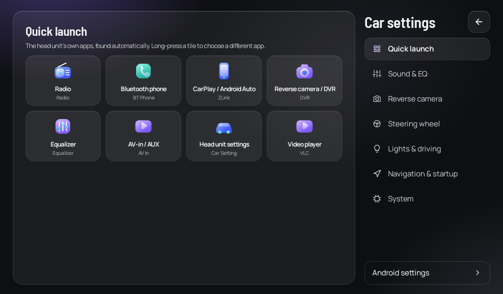 | 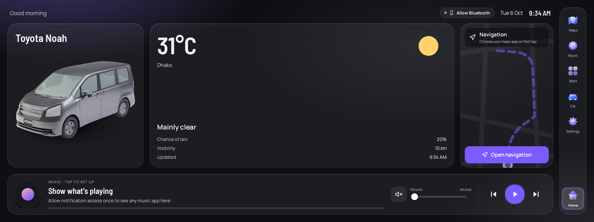 |

## Install

**Easiest:** copy `GlassLauncher.apk` to a USB stick, open it on the head unit, then press
**Home** › **Glass Launcher** › **Always**.

**With a computer (applies the theme as well):** turn on USB debugging on the unit, then run:

```sh
tools/setup-headunit.sh --theme Violet --layout dashboard     # Linux / macOS
tools\setup-headunit.bat                                      # Windows (double-click)
```

The script checks what your unit's Android version and firmware allow. What it can change, it
changes; everything else it leaves as it is and lists:

| Step | When it's applied |
|---|---|
| Install or update the APK | always |
| Location and "Nearby devices" permissions | Android 6+ (granted at install on 5.x) |
| Now-playing access (notification listener) | when the firmware allows it |
| Battery optimisation off for the launcher | Android 6+ |
| Make it the default home app | Android 7+ (otherwise press Home › Always) |
| Launcher theme, home layout, matching system wallpaper | always |
| System dark mode | Android 10+, when the firmware allows it |
| Other apps' colours, icons and fonts; boot logo, steering-key learning, EQ | never changed: needs root or the vendor app |

**Back to the stock launcher at any time:** Android Settings › Apps › Default apps › Home app.

## Controls

- **Steering-wheel and media keys:** play/pause, next, previous, fast-forward and rewind act on
  whatever app is playing. The Music key opens Music, Call opens the Bluetooth phone app,
  Settings opens Settings, Camera opens the reverse camera / DVR app, and Search opens the
  app drawer. Volume keys update the on-screen volume.
- **Rotary knob / D-pad:** every button, tile, slider and switch can take focus and shows an
  accent ring. Sliders move with left and right.
- **Head unit apps:** Radio, Bluetooth phone, CarPlay/Android Auto (ZLink etc.), reverse camera
  / DVR, EQ, AV-in, the vendor car-settings app, and music, video, files and browser are found
  by name. Use them from **Car settings › Quick launch**. To change any of them, go to
  **Settings › Connections**. If a chosen app disappears after a firmware update, the launcher
  goes back to auto-detecting it.

## Built not to break

- **Crash guard and safe mode.** Every crash is recorded. Two crashes within two minutes start
  the launcher in **safe mode**: a plain list of all your apps, plus buttons to retry, reset the
  launcher's settings, pick another home app or open Android settings. You can never get locked
  out of the head unit.
- **Per-screen recovery.** If one screen can't open, a recovery panel appears instead of a
  crash, and the rest keeps working. Settings › About device › Diagnostics shows the last
  problem.
- **Update-proof settings.** Settings carry a schema version and are migrated when it changes.
  Any value that is missing, out of range or of the wrong type falls back to a safe default.
- **Fallbacks for every feature.** Phone status uses three detection methods. Mute works on
  Android 5.x too. Media keys work without notification access. Wallpaper and dark-mode
  changes report what they couldn't do.
- **Updates keep your settings.** An update keeps your settings only if it's signed with the
  same key. Keep the `release.p12` key you were sent privately, and build with:
  `KEYSTORE=/path/release.p12 KEYSTORE_PASS=... ./build.sh`.
  The key is **not** in this repository because the repository is public.

## Real vs. not possible

| Feature | Status |
|---|---|
| Home layouts, rail, clock, theme, font size, app drawer, settings | Real |
| Music bar and Now Playing for any app (title, artist, artwork, seek, volume) | Real; track info needs notification access once |
| Weather (Open-Meteo, device location or city) | Real; needs internet |
| Navigation card | Opens your maps app. Android doesn't let a launcher read turn-by-turn directions |
| EQ, camera format, steering-key learning, lights, radio region, factory reset | Opens the head unit's own settings app (no public Android API). The launcher never resets anything itself |
| Background blur | Not used; glass panels use a translucent fill so it stays smooth on head-unit hardware |

## Build and test

Linux x86-64, JDK 17+, python3, curl, zip and unzip. No Android Studio or SDK needed.

```sh
./build.sh                 # -> dist/GlassLauncher.apk (fetches the toolchain from Maven Central)
tests/run-tests.sh         # Android 5.0-15 checks + screenshots (needs Maven)
```

## Credits

- Car 3D model "Toyota Noah" by Nieve5677 (Sketchfab), CC BY. Also credited in Settings ›
  About device.
- Fonts: Barlow Semi Condensed and Manrope, SIL Open Font License.
- Weather: Open-Meteo.com, CC BY 4.0. Check their terms before any commercial use.
